# AC Viewer  

AC Viewer 是一款专为 Active Camera 系列产品设计的软件，可用于实时显示连接至计算机的所有 Active Camera 系列产品的数据（包括点云、图像等）。  
通过 AC Viewer，用户可轻松查看、记录并储存传感器数据，以便后期使用。  

AC1 用户请下载 V1.0 版本，AC2 用户请下载 V2.0 版本。

## v1.0 使用说明

**硬件准备：** 
- Active Camera x 1
- 电源线
- 数据线
- PC x 1  


**PC硬件配置：**  
<table class="docutils align-default" style="width: 100%;">
    <tbody>
        <tr class="row-even centered-table-text">
            <td></td>
            <td style="font-weight: bold;">最低配置</td>
            <td style="font-weight: bold;">推荐配置</td>
        </tr>
        <tr class="row-odd centered-table-text">
            <td>CPU</td>
            <td>第七代 Intel Core i3或同等规格</td>
            <td>Intel 11500及以上；Mac M2以上</td>
        </tr>
        <tr class="row-even centered-table-text">
            <td>GPU</td>
            <td>集成显卡</td>
            <td>NVIDIA RTX 3060或以上规格</td>
        </tr>
        <tr class="row-odd centered-table-text">
            <td>内存</td>
            <td>8GB</td>
            <td>16GB以上</td>
        </tr>
        <tr class="row-even centered-table-text">
            <td>连接</td>
            <td>USB3.0</td>
            <td>USB3.0</td>
        </tr>
    </tbody>
</table>


**支持的操作系统：**   
- windows 10 x64   
- Ubuntu 20.04 x64  


**物理连接：**  
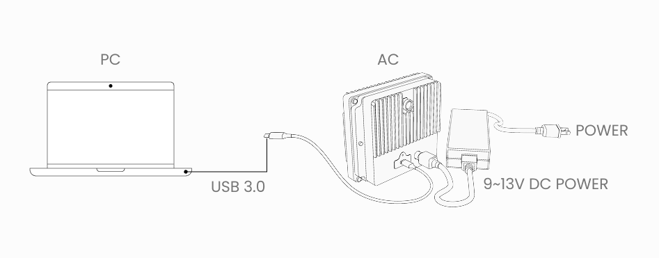  


**软件下载：**  
- [AC Viewer 1.0.11 (64 bit) - Ubuntu 20.04](https://cdn.robosense.cn/ACViewer%20Release/AcViewer_Linux_x86_64_release_1.0.11.deb)  
- [AC Viewer 1.0.11 (64 bit) - windows 10](https://cdn.robosense.cn/ACViewer%20Release/AcViewer_Win_x86_64_release_1.0.11.exe)  
- [更多历史版本](https://github.com/RoboSense-Robotics/.github/blob/main/profile/acview_download_link_cn.md)


**软件使用：**  
- 检查设备是否正常连接，检查数据流是否正常
<div style="margin-bottom: 24px; position:relative; width:100%; padding-top: 55.33%;" class="video-container">
    <iframe src="https://cdn.robosense.cn/AC_wiki/acview_check.mp4" allowfullscreen style="position:absolute; top:0; left:0; width:100%; height:100%;"></iframe>
</div>

- 录制
<div style="margin-bottom: 24px; position:relative; width:100%; padding-top: 55.33%;" class="video-container">
    <iframe src="https://cdn.robosense.cn/AC_wiki/acview_collect.mp4" allowfullscreen style="position:absolute; top:0; left:0; width:100%; height:100%;"></iframe>
</div>

- 播放
<div style="margin-bottom: 24px; position:relative; width:100%; padding-top: 55.33%;" class="video-container">
    <iframe src="https://cdn.robosense.cn/AC_wiki/acview_replay.mp4" allowfullscreen style="position:absolute; top:0; left:0; width:100%; height:100%;"></iframe>
</div>

- 离线slam
<div style="margin-bottom: 24px; position:relative; width:100%; padding-top: 55.33%;" class="video-container">
    <iframe src="https://cdn.robosense.cn/AC_wiki/acview_slam.mp4" allowfullscreen style="position:absolute; top:0; left:0; width:100%; height:100%;"></iframe>
</div>

## v2.0 使用说明

### 安装与启动

#### Ubuntu

1. 下载 ACViewer 2.X 压缩包，解压到 home 目录。

[AcViewer_Linux_x86_64_v2.0.8_2026-02-10-16-30.zip](https://cdn.robosense.cn/ACViewer%20Release/AcViewer_Linux_x86_64_v2.0.8_2026-02-10-16-30.zip)

2. 进入解压后的目录，执行以下脚本为 AC2 设置读写权限（每台电脑仅需执行一次）：

```shell
sudo bash ./Driver/AC_usb_permission.sh
```

3. （可选）如果需要运行骨架检测算法，则还需执行以下脚本下载所需的模型文件（每台电脑仅需执行一次）：

```shell
./setup_skeleton.sh
```

注意，骨架检测算法对系统有如下额外要求：
- PC配有NVIDIA GPU且架构至少是 Volta
- 安装 NVIDIA 驱动且版本不低于 535
- 预留 8~9 GB 的磁盘空间

4. 安装完成后，即可双击 AcViewer.x86_64 启动，或在终端中运行以下命令：

```shell
./AcViewer.x86_64
```

#### Windows

下载 ACViewer 2.X 压缩包，解压到某个目录（非 C 盘即可）。注意：Windows系统下，路径中不允许有中文。

[AcViewer_Win_x86_64_v2.0.8_2026-02-10-16-30.zip](https://cdn.robosense.cn/ACViewer%20Release/AcViewer_Win_x86_64_v2.0.8_2026-02-10-16-30.zip)

按照下列步骤启动：

1. 进入解压后的目录，右键点击下面这个脚本，以管理员身份运行，为 AC2 设置读写权限（每台电脑仅需执行一次）

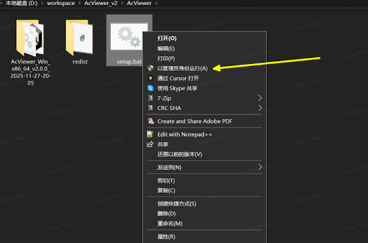

2. 进入 AcViewer_Win_x86_64_v2.0.0_xxx 文件夹，双击运行 AcViewer.exe 程序即可


### 功能使用

#### 可视化 Active Camera系列传感器数据与算法包运行效果
AC Viewer界面中间显示了三个主要数据模块，选中任一模块，下方小图就会显示目前已选中模块所包括的数据可视化效果。
点击小图，会将对应的数据在中间区域放大显示。目前有三个模块【基础】、【深度】和【骨骼】。

【基础】模块包含左右RGB相机的原始图像与染色点云。
左下角的【基础配置】配置框中,可以对点云数据中每个点的大小以及亮度进行调整，也可选中【intensity点云】来显示不着色的原始点的效果。

<style>
.img-text-group p:has(img) {
    margin-bottom: 0 !important;
}
.img-text-group .caption-text {
    margin-top: 1px !important;
}
</style>

<div class="img-text-group" style="display: inline-block; width: 49%; vertical-align: top;">

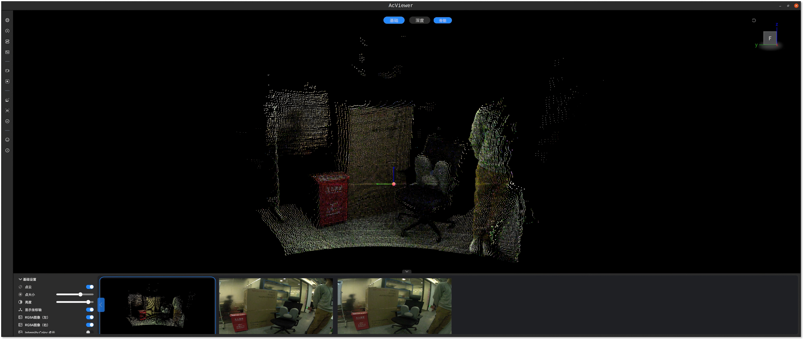

<p class="caption-text" style="text-align: center; font-size: 0.7em; color: #666;">显示RGB点云</p>

</div><div class="img-text-group" style="display: inline-block; width: 49%; vertical-align: top;">

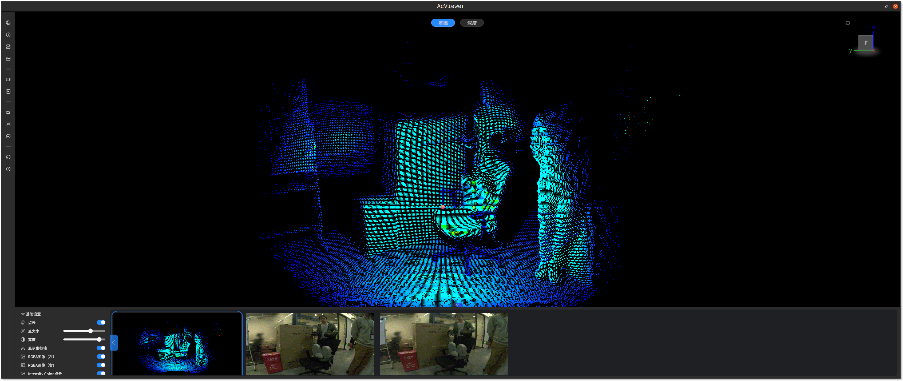

<p class="caption-text" style="text-align: center; font-size: 0.7em; color: #666;">显示原始点云</p>

</div>

选中【深度】模块后开始运行内置的点云图像融合的深度估计算法，小图部分会增加二维视差图与三维深度估计的效果。
显示视差的时候，可以在左下角的【深度设置】设置框中拖动【深度范围】来调整颜色映射范围，使视差图在当前场景下有好的显示效果。

<div class="img-text-group" style="display: inline-block; width: 49%; vertical-align: top;">

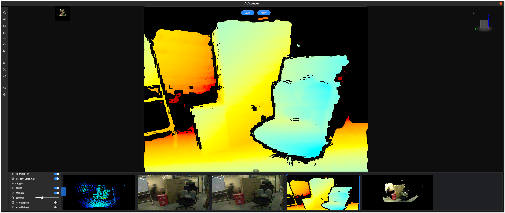

<p class="caption-text" style="text-align: center; font-size: 0.7em; color: #666;">二维视差图显示</p>

</div><div class="img-text-group" style="display: inline-block; width: 49%; vertical-align: top;">

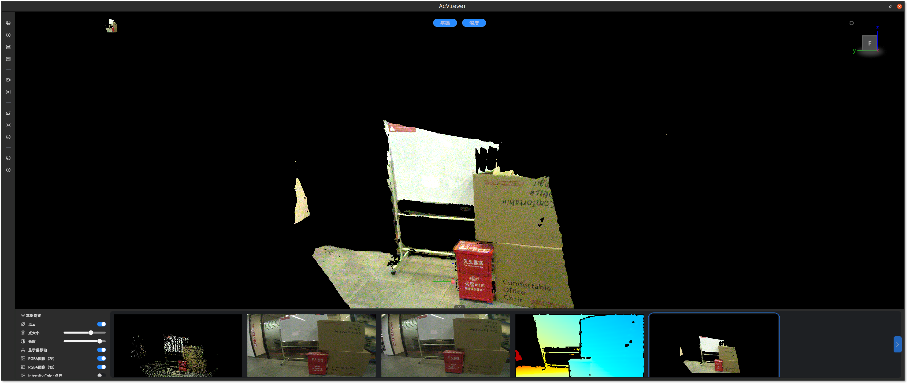

<p class="caption-text" style="text-align: center; font-size: 0.7em; color: #666;">三维深度估计结果显示</p>

</div>

选中【骨骼】模块，开始运行内置的点云图像融合的人体骨架检测算法，小图部分会增加三维的人体骨架结构与骨架点在二维图像上的投影。

<div class="img-text-group" style="display: inline-block; width: 49%; vertical-align: top;">

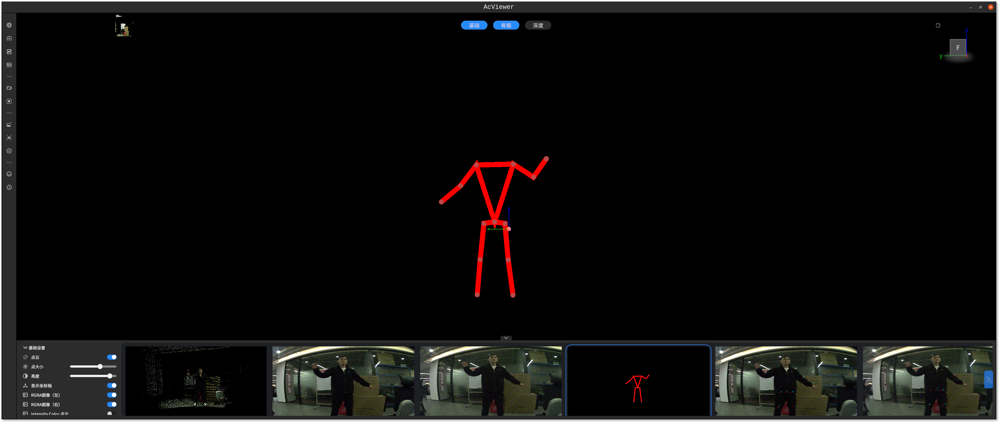

<p class="caption-text" style="text-align: center; font-size: 0.7em; color: #666;">骨架检测结果（三维）</p>

</div><div class="img-text-group" style="display: inline-block; width: 49%; vertical-align: top;">

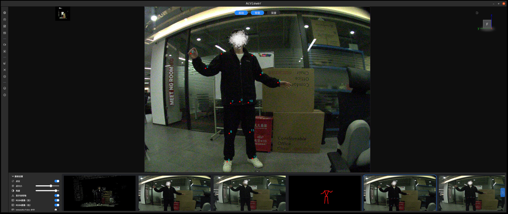

<p class="caption-text" style="text-align: center; font-size: 0.7em; color: #666;">骨架点在原始图像上的投影（二维）</p>

</div>

#### 传感器数据的录制和回放

##### 数据录制
点击左侧【录制数据】按钮，在弹出框中选择想要录制的话题名称，编辑想要保存文件的前缀与保存路径，点击【开始录制数据】，AC Viewer会将对应的传感器数据以ROS1 bag的形式保存下来，命名方式为 <前缀>_<录制时间>.bag。
录制数据默认保存在AC Viewer根目录下的 RecordData目录中。
开始录制后，左侧【录制数据】按钮会保持闪烁，表示正在录制中。再次点击该按钮停止录制。

<div class="img-text-group" style="display: inline-block; width: 49%; vertical-align: top;">

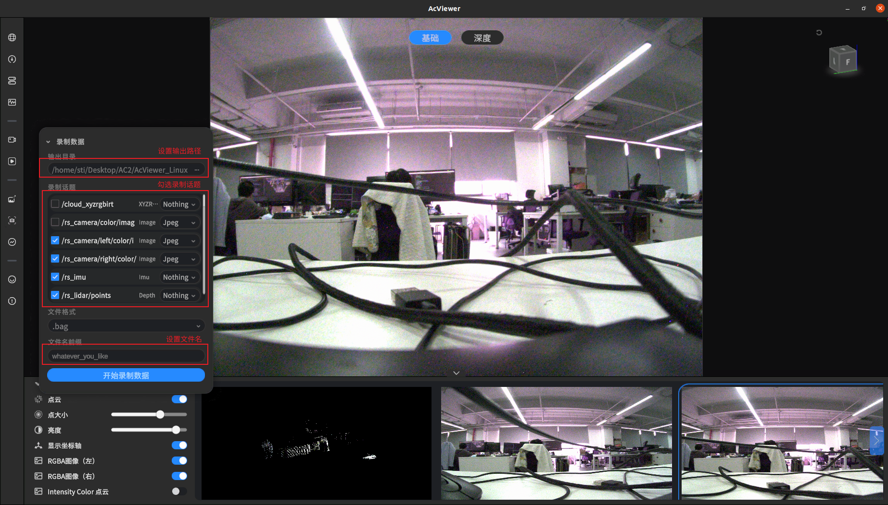

<p class="caption-text" style="text-align: center; font-size: 0.7em; color: #666;">开始录制</p>

</div><div class="img-text-group" style="display: inline-block; width: 49%; vertical-align: top;">

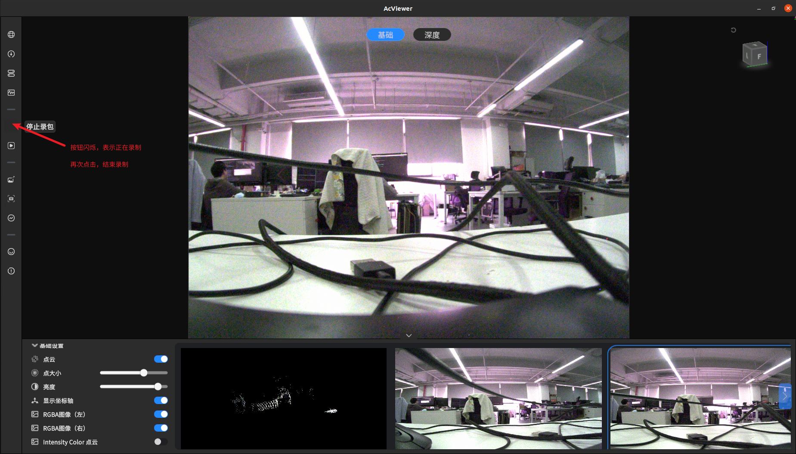

<p class="caption-text" style="text-align: center; font-size: 0.7em; color: #666;">结束录制</p>

</div>

目前仅支持保存成ROS1 bag，后续将支持保存成ROS2 bag。各话题名称含义如下：

<table class="docutils align-default" style="width: 100%;">
    <tbody>
        <tr class="row-even centered-table-text">
            <td style="font-weight: bold;">话题名称</td>
            <td style="font-weight: bold;">含义</td>
        </tr>
        <tr class="row-odd centered-table-text">
            <td>/rs_imu</td>
            <td>AC2内置IMU消息</td>
        </tr>
        <tr class="row-odd centered-table-text">
            <td>/rs_lidar/points</td>
            <td>AC2 dToF原始点云</td>
        </tr>
        <tr class="row-odd centered-table-text">
            <td>/rs_camera/left/color/image_raw/compressed</td>
            <td>AC2 左相机压缩图像</td>
        </tr>
        <tr class="row-odd centered-table-text">
            <td>/rs_camera/right/color/image_raw/compressed</td>
            <td>AC2 右相机压缩图像</td>
        </tr>
    </tbody>
</table>

##### 数据播放

点击左侧【播放数据】按钮，选择要播放的文件和话题，点击【开始播放数据】，界面下方会出现播放进度条，可以再进度条上控制开始和暂停播放，点击进度最右侧按钮可退出播放。

<div class="img-text-group" style="display: inline-block; width: 49%; vertical-align: top;">

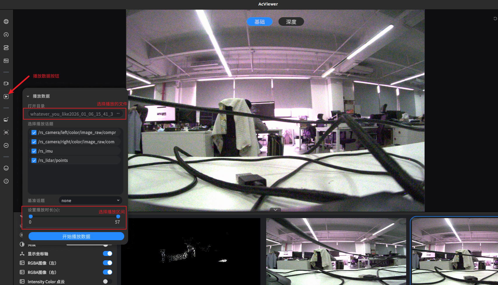

<p class="caption-text" style="text-align: center; font-size: 0.7em; color: #666;">播放数据</p>

</div><div class="img-text-group" style="display: inline-block; width: 49%; vertical-align: top;">

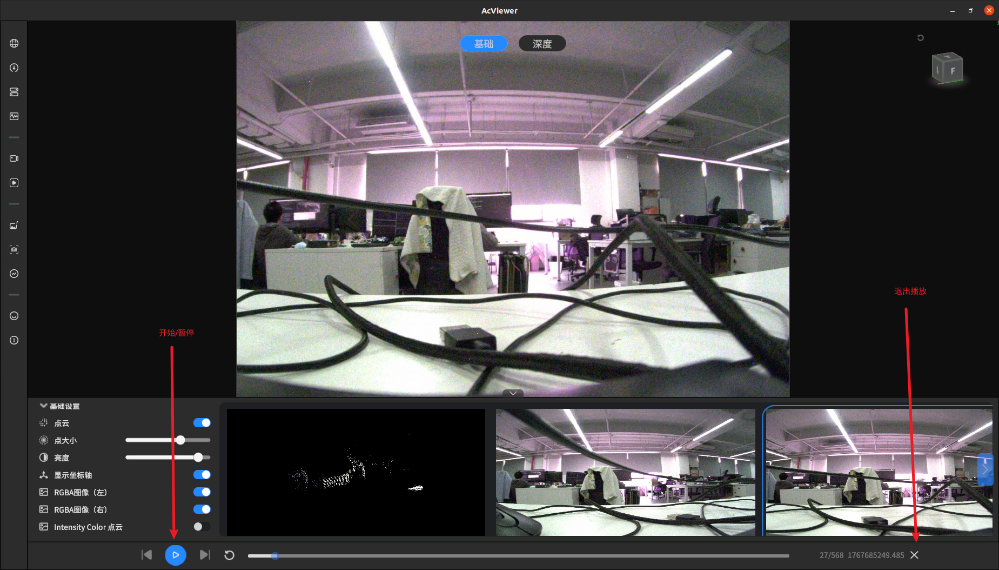

<p class="caption-text" style="text-align: center; font-size: 0.7em; color: #666;">播放控制</p>

</div>
