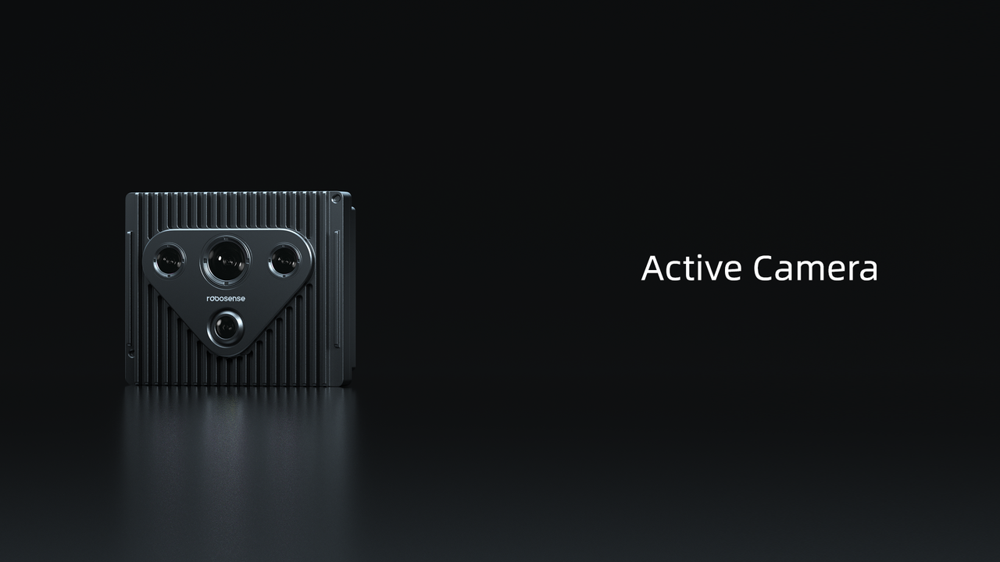
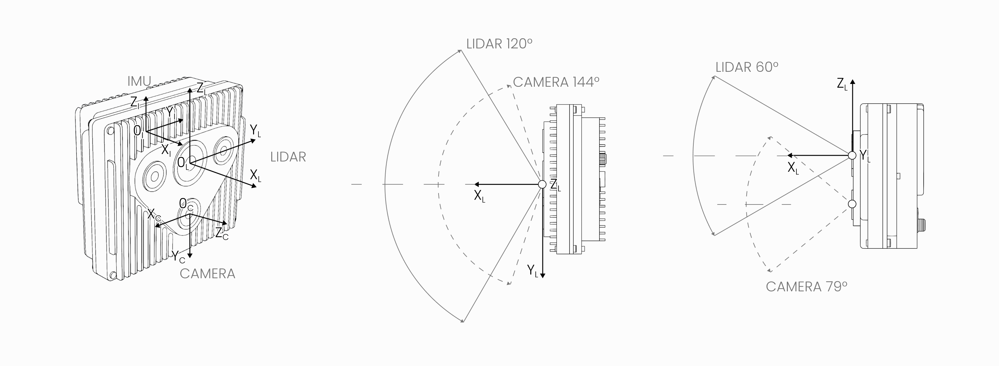
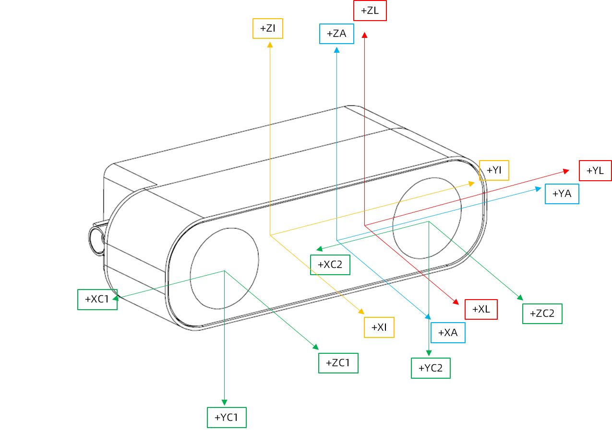
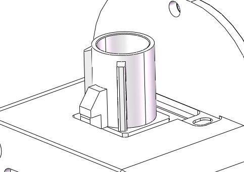
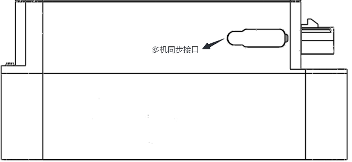
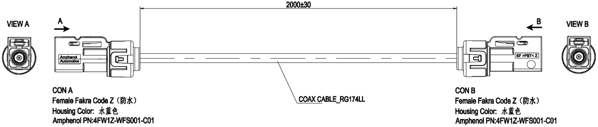
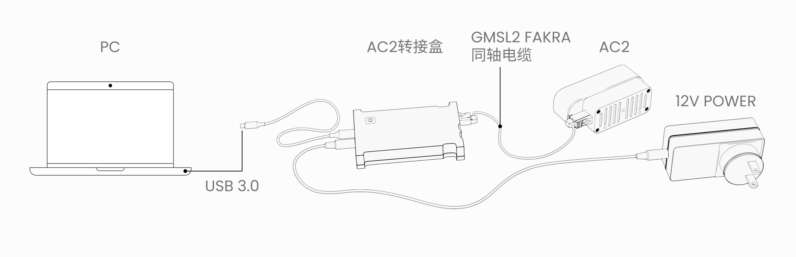

# Active Camera
为应对机器人技术中环境感知和操作认知的难题，RoboSense 通过集成多传感器，创造性发明了传感器平台 Active Camera。

为大幅降低开发门槛，提高开发效率，使开发人员能够专注于高价值的任务和功能优化，Active Camera 配备了 AI-Ready 生态，提供了包括驱动程序、标定、数据融合、SLAM 和高阶多模态感知算法等基础工作和高级工具，协助开发者实现通用、高效和优雅的解决方案，打造行为更智能、功能更丰富的机器人。

Active Camera系列目前包括AC1与AC2两款产品。

## AC1
AC1集成了单目RGB相机、LiDAR与IMU传感器，覆盖中近距离的室内外场景，能够应对绝大部分机器人室内外环境感知、定位导航、物体检测等任务。

### 规格参数

<table class="docutils align-default" style="width: 100%; table-layout: fixed;">
    <colgroup>
        <col style="width: 20%;">
        <col style="width: 30%;">
        <col style="width: 20%;">
        <col style="width: 30%;">
    </colgroup>
    <thead>
        <tr class="row-odd centered-table-text">
            <th class="head" colspan=4>Active Camera 规格参数表</th>
        </tr>
        <tr class="row-odd centered-table-text">
            <th class="head" colspan=4>激光部分</th>
        </tr>
    </thead>
    <tbody>
        <tr class="row-even centered-table-text">
            <td>测距原理</td>
            <td>TOF法测距</td>
            <td>水平视场角</td>
            <td>120°</td>
        </tr>
        <tr class="row-odd centered-table-text">
            <td>激光波长</td>
            <td>940nm</td>
            <td>垂直视场角</td>
            <td>60°</td>
        </tr>
        <tr class="row-even centered-table-text">
            <td>激光安全等级</td>
            <td>Class1人眼安全</td>
            <td>水平分辨率</td>
            <td rowspan=2>平均0.625°</td>
        </tr>
        <tr class="row-odd centered-table-text">
            <td>测距能力</td>
            <td>20m@10%</td>
            <td>垂直分辨率</td>
        </tr>
        <tr class="row-even centered-table-text">
            <td>盲区</td>
            <td>0.1m@90%</td>
            <td>精度（典型值）</td>
            <td>±3cm@1σ（室内） ±5cm@1σ（室外）</td>
        </tr>
        <tr class="row-odd centered-table-text">
            <td>出点数</td>
            <td>~173333点/秒</td>
            <td>帧率</td>
            <td>10Hz</td>
        </tr>
        <tr class="row-even">
            <th class="head" colspan=4>RGB 相机部分</th>
        </tr>
        <tr class="row-odd centered-table-text">
            <td>快门类型</td>
            <td>卷帘快门</td>
            <td>水平视场角</td>
            <td>144°</td>
        </tr>
        <tr class="row-even centered-table-text">
            <td>CIS输出格式</td>
            <td>NV12, RGB24</td>
            <td>垂直视场角</td>
            <td>78°</td>
        </tr>
        <tr class="row-odd centered-table-text">
            <td>帧率</td>
            <td>30Hz</td>
            <td>分辨率</td>
            <td>1920*1080</td>
        </tr>
        <tr class="row-even">
            <th class="head" colspan=4>IMU</th>
        </tr>
        <tr class="row-odd centered-table-text">
            <td>自由度</td>
            <td>6轴数据输出</td>
            <td>陀螺仪</td>
            <td>±2000dps</td>
        </tr>
        <tr class="row-even centered-table-text">
            <td>加速度计</td>
            <td>±16g</td>
            <td>数据频率</td>
            <td>200Hz（可调）</td>
        </tr>
        <tr class="row-odd">
            <th class="head" colspan=4>整机部分</th>
        </tr>
        <tr class="row-even centered-table-text">
            <td>形式</td>
            <td>标准探头模组</td>
            <td>功耗</td>
            <td>12.6W（典型值）</td>
        </tr>
        <tr class="row-odd centered-table-text">
            <td>工作温度</td>
            <td>-20°C ~ +60°C</td>
            <td>储存温度</td>
            <td>-20°C ~ +70°C</td>
        </tr>
        <tr class="row-odd centered-table-text">
            <td>防护等级</td>
            <td>IP54</td>
            <td>重量</td>
            <td>400g ± 10%</td>
        </tr>
        <tr class="row-even centered-table-text">
            <td>数据接口</td>
            <td>USB 3.2 Gen1</td>
            <td>电源接口</td>
            <td>dc</td>
        </tr>
        <tr class="row-odd centered-table-text">
            <td>尺寸</td>
            <td>95mm*42.6mm*80mm</td>
            <td></td>
            <td></td>
        </tr>
    </tbody>
</table> 

### 坐标系

在实际应用中，需要用到 AC1 中各个传感器的数据，这里将各个传感器的坐标系命名如下：

- 激光传感器的坐标系命名为 $O_L-X_LY_LZ_L$ ，
- 相机传感器的坐标系命名为 $O_c-X_CY_CZ_C$ ，
- IMU 传感器的坐标系命名为 $O_I-X_IY_IZ_I$ ，
- AC1 的坐标系 $O-XYZ$ 定义为激光坐标系 $O_L-X_LY_LZ_L$ 。

各个坐标系具体关系如下图所示：
  

- 激光坐标系原点 $O_L$ 在 AC 坐标系 $O-XYZ$ 上的坐标为 $(0,0,0)$（单位：mm）。  
- 相机坐标系原点 $O_C$ 在 AC 坐标系 $O-XYZ$ 上的坐标为 $(4.3,0,-26.9)$（单位：mm）。  
- IMU 坐标系原点 $O_I$ 在 AC 坐标系 $O-XYZ$ 上的坐标为 $(-10.6,-9.9,15.5)$（单位：mm）。  

### 计算平台
下表列举了一些和 Active Camera 匹配的计算平台，罗列了它们支持的 SDK 应用和系统镜像，这些系统镜像包含了编译和运行所支持的 SDK 需要的依赖。

<table class="docutils align-default">
    <tr class="centered-table-text">
        <td style="font-weight: bold;" colspan="2">计算平台名称</td>
        <td style="font-weight: bold;">通用 X86 架构计算机</td>
        <td style="font-weight: bold;">Radxa ROCK5B+</td>
        <td style="font-weight: bold;">OrangePi 5 Ultra</td>
        <td style="font-weight: bold;">NVIDIA Jetson Orin Nano Super</td>
        <td style="font-weight: bold;">NVIDIA Jetson AGX Orin</td>
        <td style="font-weight: bold;">D-Robotics RDK X5</td>
    </tr>
    <tr class="centered-table-text">
        <td colspan="2">SOC</td>
        <td>-</td>
        <td>Rockchip RK3588</td>
        <td>Rockchip RK3588</td>
        <td>Jetson Orin Nano 8GB module</td>
        <td>Jetson Orin</td>
        <td>Sunrise 5</td>
    </tr>
    <tr class="centered-table-text">
        <td colspan="2">CPU</td>
        <td>Intel® Xeon(R)  Gold 6230R CPU @  2.10GHz x 104</td>
        <td>8 核 64 位处理器  4 个 Cortex-A76@2.4GHz  4 个 Cortex-A55@1.8GHz</td>
        <td>8 核 64 位处理器  4 个 Cortex-A76@2.4GHz  4 个 Cortex-A55@1.8GHz</td>
        <td>6 个 Cortex-A78@2.4GHz</td>
        <td>12 核 Cortex-A78AE@2.2GHz</td>
        <td>8 个 Cortex-A55@1.5GHz</td>
    </tr>
    <tr class="centered-table-text">
        <td colspan="2">内存</td>
        <td>64 GB</td>
        <td>16 GB LPDDR5</td>
        <td>16 GB LPDDR5</td>
        <td>8 GB LPDDR5</td>
        <td>64 GB LPDDR5</td>
        <td>8 GB LPDDR4</td>
    </tr>
    <tr class="centered-table-text">
        <td colspan="2">AI 算力</td>
        <td>NVIDIA A40  (299.3 TOPS@INT8 GPU)</td>
        <td>6 TOPS@INT8 NPU</td>
        <td>6 TOPS@INT8 NPU</td>
        <td>67 TOPS@INT8 GPU</td>
        <td>275 TOPS@INT8 GPU</td>
        <td>10 TOPS@INT8 BPU</td>
    </tr>
    <tr class="centered-table-text">
        <td rowspan="12">支持的 SDK 1 </td>
    </tr>
    <tr class="centered-table-text">
        <td>驱动</td>
        <td>●</td>
        <td>●</td>
        <td>●</td>
        <td>●</td>
        <td>●</td>
        <td>●</td>
    </tr>
    <tr class="centered-table-text">
        <td>采集</td>
        <td>●</td>
        <td>●</td>
        <td>●</td>
        <td>●</td>
        <td>●</td>
        <td>●</td>
    </tr>
    <tr class="centered-table-text">
        <td>监控</td>
        <td>●</td>
        <td>●</td>
        <td>●</td>
        <td>●</td>
        <td>●</td>
        <td>●</td>
    </tr>
    <tr class="centered-table-text">
        <td>标定</td>
        <td>●</td>
        <td>●</td>
        <td>●</td>
        <td>●</td>
        <td>●</td>
        <td>●</td>
    </tr>
    <tr class="centered-table-text">
        <td>点云与视觉融合</td>
        <td>●</td>
        <td>●</td>
        <td>●</td>
        <td>●</td>
        <td>●</td>
        <td>●</td>
    </tr>
    <tr class="centered-table-text">
        <td>定位</td>
        <td>●</td>
        <td>●</td>
        <td>●</td>
        <td>●</td>
        <td>●</td>
        <td>●</td>
    </tr>
    <tr class="centered-table-text">
        <td>slam</td>
        <td>●</td>
        <td>●</td>
        <td>●</td>
        <td>●</td>
        <td>●</td>
        <td>●</td>
    </tr>
    <tr class="centered-table-text">
        <td>3D 高斯溅射</td>
        <td>●</td>
        <td>○</td>
        <td>○</td>
        <td>○</td>
        <td>●</td>
        <td>○</td>
    </tr>
    <tr class="centered-table-text">
        <td>稠密深度估计</td>
        <td>●</td>
        <td>●</td>
        <td>●</td>
        <td>●</td>
        <td>●</td>
        <td>○</td>
    </tr>
    <tr class="centered-table-text">
        <td>目标检测与识别</td>
        <td>●</td>
        <td>●</td>
        <td>●</td>
        <td>●</td>
        <td>●</td>
        <td>●</td>
    </tr>
    <tr class="centered-table-text">
        <td>语义分割</td>
        <td>●</td>
        <td>●</td>
        <td>●</td>
        <td>●</td>
        <td>●</td>
        <td>●</td>
    </tr>
    <tr class="centered-table-text">
        <td colspan="2">系统镜像/SDK容器 2 </td>
        <td>
            <a href="https://github.com/RoboSense-Robotics/robosense_ac_ros2_sdk_infra/tree/main/tools/compilation_envirment">
                SDK容器
            </a>
        </td>
        <td>
            <a href="https://github.com/RoboSense-Robotics/robosense_ac_ros2_sdk_infra/blob/main/tools/system_image/Radxa_Image_Readme_CN.md">
                系统镜像安装说明
            </a>
        </td>
        <td>-</td>
        <td>
            <a href="https://github.com/RoboSense-Robotics/robosense_ac_ros2_sdk_infra/blob/main/tools/system_image/Orin_Nano_Image_Readme_CN.md">
                系统镜像安装说明
            </a>
        </td>
        <td>-</td>
        <td>
            <a href="https://github.com/RoboSense-Robotics/robosense_ac_ros2_sdk_infra/blob/main/tools/system_image/RDK_X5_Image_Readme_CN.md">
                系统镜像安装说明
            </a>
        </td>
    </tr>
</table>

1 ● 和 ○ 分别代表支持（实心圆）和不支持（空心圆）。

2 Active Camera SDK在不同平台提供容器与系统镜像，其中SDK容器，提供跨平台编译和本地编译环境的 Docker 容器，包括容器管理、镜像管理以及自动化环境设置等功能；而系统镜像，则预安装了ros2 humble与SDK的三方依赖。

### 接线说明
AC1通过的数据接口为USB 3.0, 按照下图所示连接至上位机。

## AC2

AC2是Active Camera系列面向机器人操作应用的感知解决方案。

作为业界首款同时集成全固态dToF激光雷达、双目RGB相机、IMU的超级传感器系统，AC2可灵活输出融合或独立的深度、图像与运动姿态信息，广泛应用于具身智能、机械臂、工业装备、数字孪生模型搭建等领域，满足室内外各种环境下的动作捕捉、位姿识别、3D建模、建图定位等需求。

得益于RoboSense自研架构，AC2具有行业领先的±5mm超高精度、120°×90°超广FOV和强大的抗干扰能力，可抑制高反材质引起的串扰、过曝与漏检，在强光、弱光、明暗交替等复杂场景下均能表现稳定，满足机器人操作应用需求。

此外，通过强大的Al-Ready生态，AC2还能为开发者提供丰富的工具与算法资源，解决机器人操作认知难题，提升开发效率，助力开发者加速实现创新产品的商业化应用。

### 规格参数

<table class="docutils align-default" style="width: 100%; table-layout: fixed;">
    <colgroup>
        <col style="width: 20%;">
        <col style="width: 30%;">
        <col style="width: 20%;">
        <col style="width: 30%;">
    </colgroup>
    <thead>
        <tr class="row-odd centered-table-text">
            <th class="head" colspan=4>AC2 规格参数表</th>
        </tr>
        <tr class="row-odd centered-table-text">
            <th class="head" colspan=4>激光雷达部分</th>
        </tr>
    </thead>
    <tbody>
        <tr class="row-even centered-table-text">
            <td>测距原理</td>
            <td>TOF法测距</td>
            <td>水平视场角</td>
            <td>120°</td>
        </tr>
        <tr class="row-odd centered-table-text">
            <td>激光波长</td>
            <td>905nm</td>
            <td>垂直视场角</td>
            <td>90°</td>
        </tr>
        <tr class="row-even centered-table-text">
            <td>激光安全等级</td>
            <td>Class1人眼安全</td>
            <td>水平分辨率</td>
            <td>0.5°</td>
        </tr>
        <tr class="row-odd centered-table-text">
            <td>测距范围</td>
            <td>室内： 8m   室外：5m 10%ref @100klux sunlight</td>
            <td>垂直分辨率</td>
            <td>0.5°</td>
        </tr>
        <tr class="row-even centered-table-text">
            <td>盲区</td>
            <td>0.1m</td>
            <td>精度（典型值）</td>
            <td>5mm</td>
        </tr>
        <tr class="row-odd centered-table-text">
            <td>出点数</td>
            <td>432000</td>
            <td>帧率</td>
            <td>10Hz</td>
        </tr>
        <tr class="row-even">
            <th class="head" colspan=4>RGB相机部分</th>
        </tr>
        <tr class="row-odd centered-table-text">
            <td>快门类型</td>
            <td>Global Shutter</td>
            <td>水平视场角</td>
            <td>120°</td>
        </tr>
        <tr class="row-even centered-table-text">
            <td>双目baseline</td>
            <td>65mm</td>
            <td>垂直视场角</td>
            <td>90°</td>
        </tr>
        <tr class="row-odd centered-table-text">
            <td>帧率</td>
            <td>10Hz/30Hz</td>
            <td>分辨率</td>
            <td>1600*1200</td>
        </tr>
        <tr class="row-even">
            <th class="head" colspan=4>IMU</th>
        </tr>
        <tr class="row-odd centered-table-text">
            <td>自由度</td>
            <td>6轴数据输出</td>
            <td>陀螺仪</td>
            <td>±500dps</td>
        </tr>
        <tr class="row-even centered-table-text">
            <td>加速度计</td>
            <td>±4g</td>
            <td>数据频率</td>
            <td>500Hz（可调）</td>
        </tr>
        <tr class="row-odd">
            <th class="head" colspan=4>整机部分</th>
        </tr>
        <tr class="row-even centered-table-text">
            <td>形式</td>
            <td>标准探头模组</td>
            <td>功耗</td>
            <td><8W</td>
        </tr>
        <tr class="row-odd centered-table-text">
            <td>工作温度</td>
            <td>-10°C ~ +55°C</td>
            <td>储存温度</td>
            <td>-20°C ~ +70°C</td>
        </tr>
        <tr class="row-odd centered-table-text">
            <td>防护等级</td>
            <td>IP65</td>
            <td>重量</td>
            <td><240g</td>
        </tr>
        <tr class="row-even centered-table-text">
            <td>数据接口</td>
            <td>Fakra Code Z Male(GMSL2)</td>
            <td>电源接口</td>
            <td>Fakra Code Z Male(POC)</td>
        </tr>
        <tr class="row-odd centered-table-text">
            <td>尺寸</td>
            <td>102mm*32mm*45mm（长*高*宽）</td>
            <td>时间同步精度</td>
            <td>IMU RGB TOF之间硬同步，同步精度＜1ms</td>
        </tr>
    </tbody>
</table> 

### 坐标系

在实际应用中，需要用到 AC2 中各个传感器的数据，这里将各个传感器的坐标系命名如下，

- 激光传感器的坐标系命名为 $O_L-X_LY_LZ_L$
- 相机传感器的坐标系命名为 $O_{C1}-X_{C1}Y_{C1}Z_{C1}$ 、$O_{C2}-X_{C2}Y_{C2}Z_{C2}$
- IMU传感器的坐标系命名为 $O_I-X_IY_IZ_I$
- AC2 的坐标系 $O-XYZ$ 定义为激光坐标系 $O_A-X_AY_AZ_A$

各个坐标系具体关系如下图所示，

AC2坐标系 $O_A-X_AY_AZ_A$  定义为视窗表面的产品长宽方向中心位置，
- 激光坐标系原点 $O_L$ 在AC2坐标系 $O_A$ 上的坐标为$(0，3.7，0)$（单位：mm），
- 相机坐标系原点 $O_{C1}$在AC2坐标系 $O_A$ 上的坐标为$(0，-31.5，0)$（单位：mm），
- 相机坐标系原点 $O_{C2}$在AC2坐标系 $O_A$ 上的坐标为$(0，31.5，0)$（单位：mm），
- IMU坐标系原点 $O_I$ 在AC2坐标系 $O_A$上的坐标为$(-30.2，-14.5，6.2)$（单位：mm），

### 接口与接线说明
#### 接口
- 数据接口：Fakra Code Z Male，接口定义为 GMSL2。该接口同时也是供电接口，即AC2采用POC供电。

- 多机同步接口：8pin座子，pin间距0.8mm

- FAKRA同轴线：两端连接类型为Fakra Code Z Female

#### 接线说明
AC2需要搭配专用转接盒使用，按照下图所示的方式将AC2连接至转接盒，转接盒连接至上位机。

<a href="https://www.robosense.ai/rslidar/AC1" class="rounded-button" target="_blank">了解更多</a>
